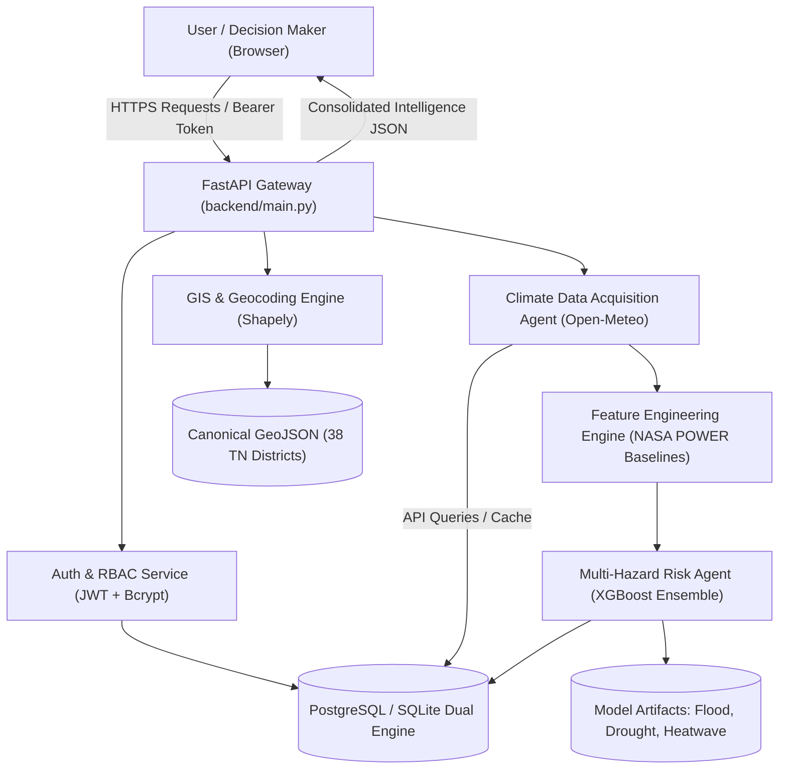

# System Architecture — Climate Risk Intelligence (Review II)

## 1. System Overview
The **Quantum Multi-Agent Decision Support System for Climate Adaptation and Mitigation Strategy Planning** is designed to provide actionable, localized, and multi-hazard climate risk intelligence for Tamil Nadu.

Review II establishes the **Core Operational Foundation**:
1. **Climate Data Acquisition Agent**: High-resolution meteorological data harvesting from Open-Meteo NWP models with caching and data quality validation.
2. **Feature Engineering & Climatology Engine**: Historical baseline calculation (2010–2026 NASA POWER) for anomaly derivation and strict 53-feature vector alignment.
3. **Multi-Hazard Risk Agent**: Machine learning ensemble (XGBoost) for daily flood, drought, and heatwave probability estimation with calibrated decision thresholds.
4. **Spatial GIS & Geocoding Engine**: Sub-second Shapely point-in-polygon resolution over all 38 Tamil Nadu administrative districts.
5. **Interactive Frontend Application**: React + Vite + Leaflet + Tailwind CSS delivering Weather, Risk Choropleths, and System Monitoring dashboards.

---

## 2. Multi-Agent Communication Architecture

---

## 3. Data Flow

1. **Location Request**: User searches for "Marina Beach" or drops a pin on the map.
2. **Spatial Containment**: The Geocoding Engine performs Shapely point-in-polygon lookup against `tamil_nadu_districts.geojson` and identifies `Chennai` (`district_id: chennai`).
3. **Weather Harvesting**: The Climate Data Acquisition Agent fetches 7-day hourly and daily weather metrics for the coordinates from Open-Meteo (or serves cached data).
4. **Feature Transformation**: The Feature Engineering Engine matches the district with its historical climatological normal from `district_climatology.json`, calculating rolling rainfall (`rainfall_3d`, `7d`, `30d`), temperature and rainfall anomalies, and SPI indices.
5. **Ensemble Inference**: The Multi-Hazard Risk Agent formats the strict 53-element feature vector, queries the trained XGBoost models, and applies calibrated operational thresholds (`HIGH` $\ge 0.70$, `MEDIUM` $\ge 0.40$, `LOW` $< 0.40$).
6. **Delivery**: The consolidated response is returned to the user with full transparency, uncertainty flags, and demographic exposure context.

---

## 4. Technology Stack

- **Backend**: Python 3.10+, FastAPI, Uvicorn, SQLAlchemy 2.0, Pydantic v2, Shapely, PyJWT, Passlib (Bcrypt), NumPy, Pandas, Scikit-Learn, XGBoost.
- **Frontend**: React 19, Vite, React-Router-DOM, Leaflet & React-Leaflet, Lucide-React, Recharts, Tailwind CSS.
- **Data & GIS**: WGS84 GeoJSON (38 Districts), NASA POWER 2010–2026 Climatology, Open-Meteo NWP Forecast.
