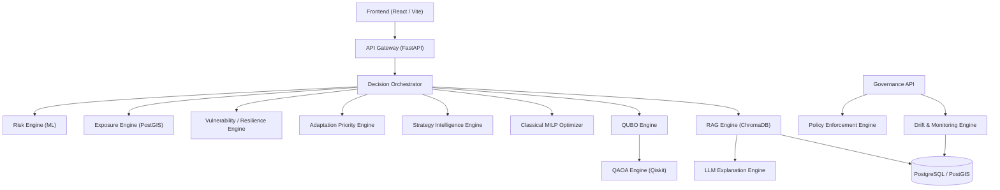

# Phase R — Service Dependency Graph & Architecture Mapping

## 1. Architectural Topology

## 2. Service Inventory & Criticality Mapping

| Service ID | Service Name | Criticality | Runtime | Dependencies | Fallback Behavior |
| :--- | :--- | :--- | :--- | :--- | :--- |
| `SVC-001` | API Gateway | CRITICAL | Python 3.10 / FastAPI | Uvicorn, PostgreSQL | Health probe failover |
| `SVC-002` | Decision Orchestrator | CRITICAL | Python 3.10 | PostgreSQL, Risk, MILP, RAG | Return degraded decision status |
| `SVC-003` | Risk Engine | CRITICAL | Python 3.10 / XGBoost | Feature Pipeline, PostGIS | Use historical baseline risk |
| `SVC-004` | Exposure Engine | HIGH | Python 3.10 / PostGIS | PostgreSQL, GeoJSON | Use district centroid spatial lookup |
| `SVC-005` | Vulnerability Engine | HIGH | Python 3.10 | Census/Socio-economic DB | Use baseline district vulnerability |
| `SVC-006` | Priority Engine | HIGH | Python 3.10 | Risk, Vulnerability | Priority matrix rule lookup |
| `SVC-007` | Strategy Engine | HIGH | Python 3.10 | Strategy Registry | Candidate strategy catalog default |
| `SVC-008` | Classical MILP | CRITICAL | Python 3.10 / PuLP | Strategy Engine, Budget | Greedy strategy selection fallback |
| `SVC-009` | QUBO Engine | HIGH | Python 3.10 / NumPy | MILP formulation | MILP mathematical translation |
| `SVC-010` | QAOA Engine | LOW | Python 3.10 / Qiskit | QUBO Engine | Simulator baseline fallback ($Gap=0.4700$) |
| `SVC-011` | RAG Engine | HIGH | Python 3.10 / ChromaDB | Vector Store | Static citation fallback |
| `SVC-012` | LLM Engine | MEDIUM | Python 3.10 | RAG Engine, Prompts | Deterministic template summary |
| `SVC-013` | PostgreSQL/PostGIS | CRITICAL | PostgreSQL 15 | Disk Storage | Secondary read-replica fallback |
| `SVC-014` | ChromaDB | HIGH | ChromaDB 0.4 | Disk Storage | In-memory index fallback |
| `SVC-015` | Frontend UI | HIGH | React / Vite | API Gateway | Read-only static dashboard mode |
| `SVC-016` | Data Ingestion | MEDIUM | Python 3.10 / Cron | IMD / NASA POWER | Fallback to offline climatology |
| `SVC-017` | Governance API | HIGH | Python 3.10 / FastAPI | Policy Engine, Registries | Cache static governance status |
| `SVC-018` | Monitoring Service | HIGH | Python 3.10 | System Logs, Registries | Alert notification retry queue |
